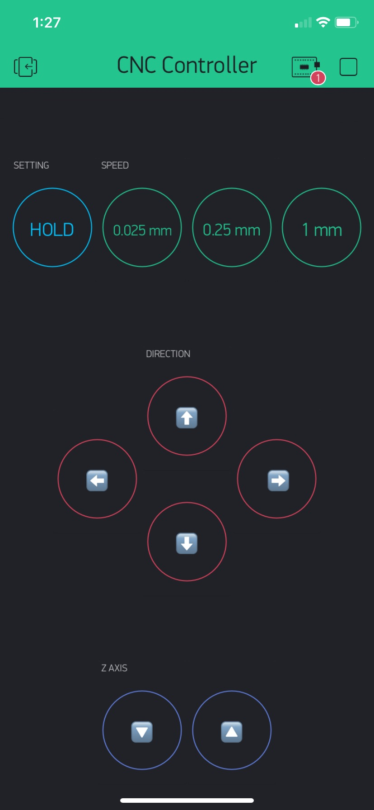

# CNC-Mobile-Controller

This Python client receives inputs from a custom project in the Blynk mobile app and uses them to simulate keyboard clicks for input into the Carbide Motion jogging pane. This allows for remote interaction with CNC router using a mobile device rather than the physical computer keyboard.

To use the same Blynk project template, use this QR code:

Virtual Pin - Key Mappings:
- V1: Speed 1
- V2: Speed 2
- V3: Speed 3
- V4: Toggle hold/press mode
- V5: Direction up
- V6: Direction down
- V7: Direction left
- V8: Direction right
- V9: Z axis down
- V10: Z axis up

To use this client:
1. Create a Blynk project that uses buttons mapped to each of the virtual pins listed above
2. Copy the blynk authorization token into a file called "auth_vars.py" as follows: `BLYNK_AUTH = "<your auth token>"`
3. From a terminal in the current directory, install dependencies using `pip install -r requirements.txt`, and then run `python3 app.py`
4. Bring Carbide Motion software window to the front in the jogging tab
5. Use the controls in the Blynk app to control CNC remotely
